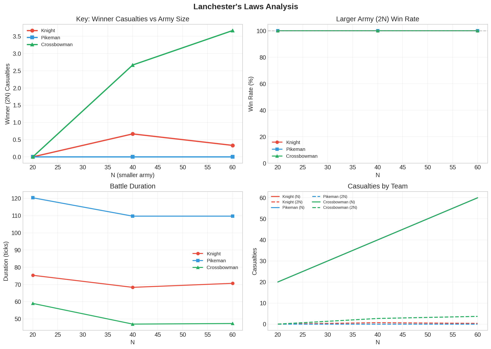

# Lanchester Analysis Report

**Generated:** 2025-12-16 20:53:40

---

## Configuration

| Parameter | Value |
|-----------|-------|
| AI | DAFT |
| Scenario | Lanchester |
| Unit Types | Knight, Pikeman, Crossbowman |
| N Range | 20 to 60 (3 values) |
| Repetitions | 3 per configuration |
| Total Simulations | 27 |

---

## Lanchester's Laws

This analysis tests Lanchester's Laws of combat:

- **Linear Law (Melee):** In melee combat, casualties are proportional to N. 
  Each soldier can only engage one enemy at a time.

- **Square Law (Ranged):** In ranged combat, effectiveness scales with N². 
  Multiple soldiers can focus fire on the same target.

### Scenario: N vs 2N

The Lanchester scenario pits N units (Team A) against 2N units (Team B).
The larger army (2N) should win every time, but what's interesting is:

- How many casualties does the winning side (2N) sustain?
- Does casualty scaling differ between melee and ranged units?

---

## Results by Unit Type

### Knight

Knights are melee units. According to Lanchester's Linear Law, in melee combat each soldier can only engage one enemy at a time, so the advantage of larger numbers scales linearly.

#### Data Table

| N | Team A (N) | Team B (2N) | A Casualties | B Casualties | B Win Rate | Duration |
|---|------------|-------------|--------------|--------------|------------|----------|
| 20 | 20 units | 40 units | 20.0 | 0.0 | 100% | 75 ticks |
| 40 | 40 units | 80 units | 40.0 | 0.7 | 100% | 68 ticks |
| 60 | 60 units | 120 units | 60.0 | 0.3 | 100% | 71 ticks |

### Pikeman

Pikemen are melee units with extended reach. They should generally follow Lanchester's Linear Law, though their formation mechanics may introduce some variation.

#### Data Table

| N | Team A (N) | Team B (2N) | A Casualties | B Casualties | B Win Rate | Duration |
|---|------------|-------------|--------------|--------------|------------|----------|
| 20 | 20 units | 40 units | 20.0 | 0.0 | 100% | 120 ticks |
| 40 | 40 units | 80 units | 40.0 | 0.0 | 100% | 110 ticks |
| 60 | 60 units | 120 units | 60.0 | 0.0 | 100% | 110 ticks |

### Crossbowman

Crossbowmen are ranged units. According to Lanchester's Square Law, in ranged combat multiple soldiers can focus fire on the same target, so the advantage of larger numbers scales quadratically.

#### Data Table

| N | Team A (N) | Team B (2N) | A Casualties | B Casualties | B Win Rate | Duration |
|---|------------|-------------|--------------|--------------|------------|----------|
| 20 | 20 units | 40 units | 20.0 | 0.0 | 100% | 59 ticks |
| 40 | 40 units | 80 units | 40.0 | 2.7 | 100% | 47 ticks |
| 60 | 60 units | 120 units | 60.0 | 3.7 | 100% | 47 ticks |

---

## Summary Statistics

### Knight

- **Average 2N Win Rate:** 100.0%
- **Average 2N Casualties:** 0.3
- **Min/Max 2N Casualties:** 0.0 / 0.7

### Pikeman

- **Average 2N Win Rate:** 100.0%
- **Average 2N Casualties:** 0.0
- **Min/Max 2N Casualties:** 0.0 / 0.0

### Crossbowman

- **Average 2N Win Rate:** 100.0%
- **Average 2N Casualties:** 2.1
- **Min/Max 2N Casualties:** 0.0 / 3.7

---

## Visualization

---

## Interpretation

### Comparing Melee vs Ranged

- **Knights (Melee):** Should follow Linear Law - casualties scale linearly with N
- **Crossbowmen (Ranged):** Should follow Square Law - casualties scale with N²

The graph should show different curve shapes for each unit type, 
demonstrating the fundamental difference between ancient/melee and modern/ranged combat.

---

*Report generated by MedievAIl bAIttle generAIl*
